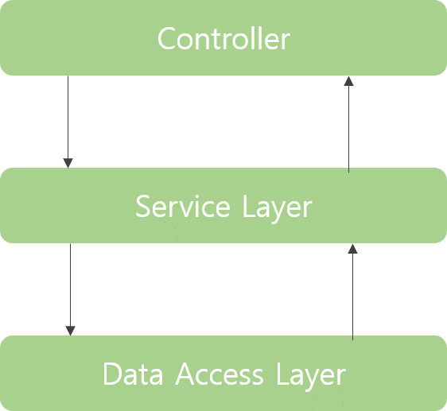

# 3계층 구조 설계



3계층 구조 설계는 백엔드 코드를 3개의 구조로 나눠 구현하는 것을 말한다. `Controller`, `Service`, `Data Access`계층으로 나눠져 있다. `Data access`계층은 `Model` 계층으로도 쓰인다.

## Controller layer

사용자의 request를 분석한 후 알맞은 서비스로 요청을 전달한 다음 서비스의 결과를 다시 response하는 계층이다. Routing이 이뤄지는 계층이다.

## Service layer

Controller로 부터 전달된 요청에 로직을 적용하는 계층이다. 예를 들어 로그인 서비스의 경우 로직은 조건문으로 데이터베이스에 회원 정보가 존재하는지 확인하는 동작을 말한다.

## Data Access layer

Service 계층에서 데이터베이스 접근이 필요한 경우가 발생하는데 데이터에 대한 코드가 작성되는 계층이다. 로그인 서비스에서 회원의 정보가 데이터베이스에 존재하는지 확인해야 하고 존재 하게 되면 서비스 계층에 존재한다고 응답을 하게 된다.

## 3계층 구조의 장점

Routing 관련 코드는 `Controller`, 서비스 관련 코드는 `Service`, 데이터 관련 코드는 `Model`에서 관리하게 되어 필요한 코드를 찾기 쉽고 유지보수가 용이해진다.

# 프로젝트 구현하기

## 프로젝트 폴더 구조 확인하기

```bash
├── client
│   ├── public
│   └── src
├── server
│   ├── config
│   ├── db
│   ├── middlewares
│   ├── routers
│   └── services
└── tools
```

Backend 코드는 `server`폴더에 구현하고 React를 사용하는 Frontend 코드는 `client`폴더에 구현한다. Backend는 `middleware`가 추가된 3계층 구조를 따른다. `config`는 localhost에서 테스트할 때 데이터베이스 사용자 이름과 비밀번호 등이 들어가게 되며 github나 배포시에는 올라가지 않는다.

# Backend

## Router

Backend 3계층 구조의 첫 단계인 routing을 담당하는 부분이다. 이 포스트에서는 간단하게 사용자 정보를 저장하는 동작을 설명한다.

```jsx
// routers/userRouter.js
const express = require("express")
const userRouter = express.Router()

const { userAuthService } = require("../services/userService")

userRouter.post("/api/users/register", async (req, res) => {
  console.log("userRouter.....")
  try {
    const name = req.body.name
    const email = req.body.email
    const password = req.body.password

    const newUser = await userAuthService.addUser({
      name,
      email,
      password,
    })
    res.status(200).json(newUser)
  } catch (error) {
    console.log(error.message)
  }
})

module.exports = { userRouter }
```

`userRouter.js`의 코드이다. express 모듈에서 `Router()`를 사용하여 요청을 할 수 있다. 사용자의 정보를 저장하는 경우를 가정하고 코드를 작성하였다. 사용자 정보를 `POST`방식으로 service 단계로 요청을 하게 된다.

## Service

```jsx
// services/userService.js
const uuid = require("uuid")
const { User } = require("../db")

class userAuthService {
  static async addUser({ name, email, password }) {
    const id = uuid.v4()
    console.log(id)

    const newUser = { id, name, email, password }

    // > db에 저장하기
    const createNewUser = await User.create({ newUser })
    console.log("db에 사용자가 정상적으로 등록되었습니다.")

    return createNewUser
  }
}

module.exports = { userAuthService }
```

`userService.js`의 코드이다. `userRouter.js`에서 넘어온 정보들을 가지고 `User`모델에 사용자를 등록하는 로직이 구현되어 있다. 위 코드에서 `uuid`는 네트워크 상에서 고유성이 보장되는 id를 만들기 위한 표준 규약으로 유일한 id를 나타내기 위해 사용했다. 작은 프로젝트이기 때문에 큰 의미는 없다.

데이터베이스에 저장하기 위해 로직이 정상적으로 끝나게 되면 `Data access layer`로 정보를 전달한다.

## Data Access

```jsx
// db/models/Users.js
const { UserModel } = require("../schemas/User")

class User {
  static async create({ newUser }) {
    console.log("models create.....")
    const createNewUser = await UserModel.create(newUser)
    return createNewUser
  }
}

module.exports = { User }
```

데이터베이스 계층은 `Model layer`로 불리기도 하지만 이 포스트에서는 Data access를 사용합니다. Data Access 계층에서는 Service에서 전달한 데이터를 데이터베이스에 직접 추가하는 부분이다. MongoDB의 명령어인 `create`를 사용해서 전달받은 사용자 정보를 등록하게 된다.

### Database Schema

```jsx
// db/schemas/User.js
const mongoose = require("mongoose")

// > 우선은 bcrypt 없이 사용자 스키마 만들기
const userSchema = mongoose.Schema({
  id: {
    type: String,
    required: true,
  },
  name: {
    type: String,
    maxlength: 20,
    required: true,
  },
  email: {
    type: String,
    unique: true,
    required: true,
  },
  password: {
    type: String,
    minlength: 6,
    required: true,
  },
})
const UserModel = mongoose.model("User", userSchema)

module.exports = { UserModel }
```

데이터베이스의 스키마는 위와 같다. 데이터베이스 스키마를 정의하고 mongoDB의 모델을 만든 후 exports 해준다.

3계층 구조를 사용해서 Backend 부분을 구현해 보았다. 3계층 구조로 구현한 후 backend의 index.js가 정말 깔끔하게 구현되는 것을 느꼈다. 구현 방식에 따라 폴더 구조는 바뀔 수 있겠지만, 코드 관리가 쉬워질 것 같다.

이 포스트에서 설명한 프로젝트 템플릿은 [여기](https://github.com/nowgnas/project-template)에 있다. 이 템플릿은 `Node js`와 `React`를 동시에 열어 테스트 할 수 있게 만들어 놓은 프로젝트 템플릿이다. User에 대한 파일만 만들어 놨으며 내부 코드는 변경해서 사용하면 된다.
