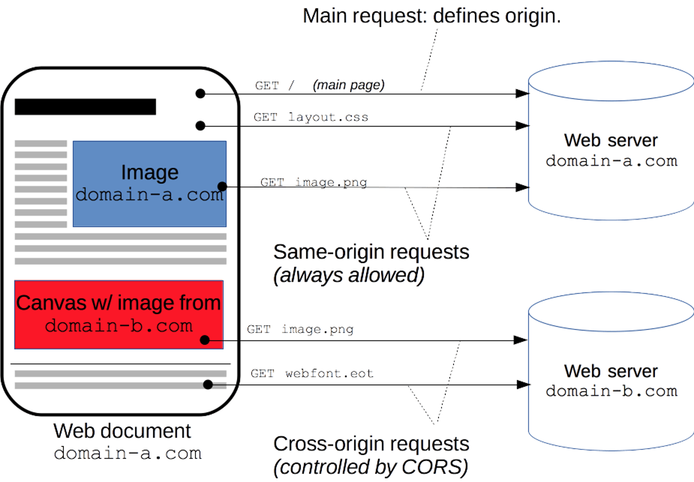

> [MDN web docs](https://developer.mozilla.org/ko/docs/Web/HTTP/CORS)를 정리하였습니다.

# CORS(Cross-Origin Resouce Sharing)

> 다른 도메인에서의 자원을 호출하는 행위에 제한이 없을 경우 안전하지 않습니다. **CORS** 
> (Cross-Origin Resource Sharing)는 이렇게 시스템 수준에서 타 도메인 간 자원 호출을 승인하거나 차단하는 것을 결정하는 것입니다. 출처:[MDN](https://developer.mozilla.org/ko/docs/Glossary/CORS)



[MDN web docs](https://developer.mozilla.org/ko/docs/Web/HTTP/CORS)

웹 애플리케이션은 리소스가 자신의 출처(도메인, 프로토콜, 포트)와 다를 경우 교차 출처 HTTP 요청을 하게 된다. 예를 들어 `http://domainA.com` 에서 `http://domainB/userlist`로 요청하는 경우 보안상의 이유로 브라우저가 교차 HTTP 요청을 제한한다.

# How to use cors in Express

## Install cors with npm

```bash
npm install cors --save
```

cors 패키지를 npm install 명령어를 사용해서 의존성에 추가해 줍니다.

```jsx
import cors from "cors";
import express from "express";

const app = express();

// CORS 에러 방지
app.use(cors());
...
```

`App.js`에서 cors를 import 한 다음 위와 같이 사용한다. `cors`는 미들웨어이며, `cors(option)`으로 사용할 수도 있다.

Node js와 React js로 프로젝트를 만들 때 Node js의 포트는 5001, React js의 포트는 3000을 사용하므로 `cors()`가 없을 경우 각 도메인의 포트가 다르므로 HTTP 요청 시 cors issue가 발생한다.

```bash
Access to XMLHttpRequest at 'http://localhost:5001/user/login'
from origin 'http://localhost:3000' has been blocked by CORS policy:
	Response to preflight request doesn't pass access control check: No '
	Access-Control-Allow-Origin' header is present on the requested resource.
```

위 오류를 보면 `XMLHttpRequest`를 3000번 포트에서 5001번 포트로 요청이 `CORS`정책에 의해 막혔다는 내용이다. `App.js`에서 `app.use(cors())`를 추가해 주면 오류 없이 잘 동작한다.
