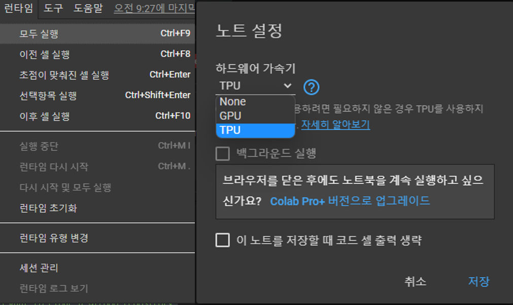
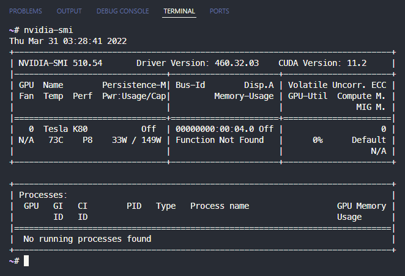

딥러닝으로 실험을 할 때 서버나 그래픽 카드가 없어 Colab에서 작업을 했었다. 구글의 Colab을 사용하면서 vscode나 Pycharm에서 연동해서 gpu를 사용하고 싶었지만 항상 Colab에 들어가서 작업을 했다. 이번 포스트에서는 vscode와 Colab을 연동해서 구글의 gpu를 사용하는 방법을 알아보자!!

### 작업 환경

- OS: Windows
- IDE: Visual Studio Code
- Google Colab

## vscode extension


vscode에서 필요한 플러그인은 SSH와 연관된 것을 설치해 준다.

## Cloudflare

Cloudflare를 사용해서 ssh를 통해 vscode와 Colab을 연동해서 사용할 수 있다. [Windows](https://developers.cloudflare.com/cloudflare-one/connections/connect-apps/install-and-setup/installation/#windows)를 위한 cloudflare 바이너리 파일을 설치한다.

## ssh config

SSH에 관련된 플러그인이 설치가 되었다면, vscode에서 `ctrl+shift+p`를 눌러준다.


Remote-SSH를 사용한 동작들이 나오게 된다. 위 그림 처럼 나오지 않는다면 `Remote-SSH`를 타이핑 하면 나온다.

먼저 ssh config 파일을 설정해야 한다. `Open SSH Configuration File...`을 선택해 준다.


vscode에서 알아서 config 파일을 잡아주는데, `\.ssh\config`를 선택해 준다.


```bash
Host *.trycloudflare.com
    HostName %h
    User root
    Port 22
    ProxyCommand C:\\Users\\<UserName>\\cloudflared.exe access ssh --hostname %h
```

config 파일이 열리게 된다. 위에서 설치한 cloudflare 바이너리 파일의 경로를 `ProxyCommand`에 적어준다. 윈도우 환경에서는 경로에 `\\`를 해줘야 오류가 나지 않는다. `HostName`에 `%h`는 나중에 Colab에서 경로를 받는다.

## Colab 설정하기

Colab을 처음 시작하는 사람이라면 구글 드라이브에서 `우클릭→더보기→연결할 앱→Colabatory 검색, 설치`로 Colab을 설치해준다.

Colab도 설치가 되었다면 구글 드라이브에서 새 Colab 파일을 생성한다. 먼저 GPU를 사용하고 싶기 때문에 런타임 환경을 GPU로 변경해 준다. `런타임->런타임 유형 변경->GPU 선택`



```python
from google.colab import drive

drive.mount('/content/drive')
```

```python
!pip install colab_ssh --upgrade
```

```python
from colab_ssh import launch_ssh_cloudflared, init_git_cloudflared
launch_ssh_cloudflared(password="PASSWORD")

# Optional: if you want to clone a github repository
# init_git_cloudflared(githubRepositoryUrl)
```

- 구글 드라이브 저장소를 colab에서 사용하도록 드라이브를 마운트 시켜준다.
- ssh로 cloudflare를 연결할 수 있도록 colab_ssh를 설치해 준다.
- `launch_ssh_cloudflared`로 ssh 터미널을 열어준다.


모두 실행(ctrl+F9)을 해주면 위 그림처럼 ssh terminal과 vscode remote ssh 경로가 나온다. 이제 vscode에서 연결을 시도해 보자.

## vscode와 colab 연동


vscode로 돌아와 `ctrl+shift+p`를 눌러 `Connect to Host`를 선택한다.


colab에서 얻은 vscode remote ssh 경로를 복사해서 붙여넣어준다. 다음으로 환경을 선택하라고 나올 수 있는데 `Linux`를 선택해주고, 비밀번호를 입력해준다.


연결에 성공하게 되면 왼쪽 아래애 `SSH:~~`로 표시가 되면 정상적으로 연결된 것이다. 터미널에 GPU를 사용하는지 확인하기 위해 터미널에 `nvidia-smi`를 입력한다. 아래처럼 나온다면 정상적으로 GPU를 사용하고 있는 것이다. (CPU나 TPU를 사용하면 아무것도 뜨지 않는다)



이제 구글 드라이브 저장소에 접근해서 작업을 하면 된다. Open folder를 눌러`/content/drive/MyDrive/`로 접근하면 구글 드라이브 저장소에서 작업이 가능하다.


이전에 했던 Mnist GAN 모델을 돌려보았다. colab과 동일하게 학습도 잘 되고 속도도 빠르다.

### 단점들

vscode에서 작업을 할 수 있고 파일 경로도 ide에서 쓰던 방식으로 할 수 있어서 좋다. 하지만 귀찮은 부분이 조금 있다.

- colab gpu를 사용하기 위한 ssh 경로 생성 코드를 연결할 때마다 실행시켜줘야 한다.
- extension을 매번 설치해야 한다.
  - 새로운 연결이 생길때 마다 vscode가 인식하는 환경은 같은 ssh 환경이 아니기 때문이다. 기본적으로 python관련된 플러그인이나, jupyter 등은 필요한데 이부분은 `settings sync`를 활용하면 조금 편하게 사용할 수 있다.
- 작업 완료 시 connection을 종료시켜줘야 한다.
  - connection을 종료시켜주지 않으면 colab 서버에서는 계속 사용하는것으로 인식할 수 있어 종료해 줘야 한다. connection 종료는 왼쪽 아래 `SSH:~`를 눌러 종료 옵션을 선택하거나 `ctrl+shift+p`로 close connection을 해주면 된다.

규모가 큰 프로젝트는 colab pro를 구독하거나 그래픽 서버를 이용하는 것이 바람직하다. 약간의 귀찮음이 있지만, 잘 사용할 것 같다.
