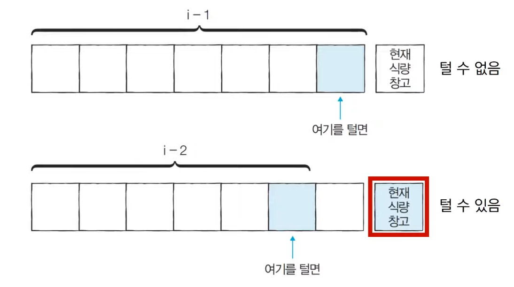

> [이것이 취업을 위한 코딩 테스트다](https://www.youtube.com/playlist?list=PLRx0vPvlEmdAghTr5mXQxGpHjWqSz0dgC)를 정리한 글입니다.

# 다이나믹 프로그래밍

메모리를 적절히 사용해서 수행 시간을 향상시키는 방법이다

한 번 계산한 문제는 다시 계산하지 않도록 구현된다. 완전 탐색보다 시간 복잡도를 줄일 수 있다.

탑 다운과 바텀 업 방식 두가지가 있다

- 동적 계획법이라고도 한다
- 최적 부분 구조
  - 큰 문제를 작은 문제로 나눌 수 있으며 작은 문제의 답을 모아서 큰 문제를 해결할 수 있다
- 중복되는 부분 문제
  - 동일한 작은 문제를 반복적으로 해결해야 한다

# 메모이제이션

- 하향식 방식
- 한번 계산한 결과를 메모리 공간에 메모하는 기법
- 같은 문제를 다시 호출하면 메모했던 결과를 가져온다
- 값을 기록해 놓는다는 점에서 캐싱이라고 한다

# 탑 다운, 바텀 업

- 탑 다운(메모이제이션) 은 하향식이고 바텀업은 상향식이다
- dp의 전형적인 형태는 바텀 업이다
  - 결과 저장용 리스트는 dp 테이블이라고 한다
- 메모이제이션은 이전에 계산된 결과를 일시적으로 기록해 놓는 넓은 개념이다

# 다이나믹 vs 분할 정복

- 다이나믹 프로그래밍과 분할 정복은 모두 최적 부분 구조를 가질 때 사용할 수 있다
  - 큰 문제를 작은 문제로 나눠서 해결 할 수 있는 공통점
- 차이점은 부분 문제의 중복이다
  - 다이나믹은 각 부분 문제들이 서로 영향을 미치며 부분 문제가 중복된다
  - 분할정복은 문제에서 동일한 부분 문제가 반복적으로 계산되지 않는다

# dp 문제에 접근하는 방법

- dp 유형의 문제임을 파악하는 것이 중요
- 그리디, 구현, 완전 탐색 등으로 해결할 수 있는지 검토
  - 다른 문제로 해결이 안되면 다이나믹으로 해보기
- 재귀 함수로 비효율적인 완전 탐색으로 작성한 뒤 작은 문제에서 구한 답이 큰 문제에서 그대로 사용될 수 있으면 코드를 개선하는 방법을 사용
- 기본 유형의 dp문제가 나올 수 있다

# 1로 만들기

- 정수 X가 주어졌을 때, 정수 X에 사용할 수 있는 연산은 4가지이다.
  1. X가 5로 나누어 떨어지면, 5로 나눈다.
  2. X가 3으로 나누어 떨어지면, 3으로 나눈다.
  3. X가 2로 나누어 떨어지면, 2로 나눈다.
  4. X에서 1을 뺀다.
- 정수 X가 주어졌을 때, 연산 4개를 적절히 사용하여 값을 1로 만드려고 한다. 연산을 사용하는 최소 횟수를 구하라.

## 점화식

$$
a_i = min(a_{i-1}, a_{i/2}, a_{i/3}, a_{i/5})+1
$$

- $a_i = i$를 1로 만들기 위한 최소 연산 횟수
- 1을 빼는 연산을 제외하고는 해당 수로 나눠 떨어질 때에 한해 점화식을 사용할 수 있다.

```python
# 정수 X를 입력 받기
x = int(input())

# 앞서 계산된 결과를 저장하기 위한 DP 테이블 초기화
d = [0] * 30001

# 다이나믹 프로그래밍(Dynamic Programming) 진행(보텀업)
for i in range(2, x + 1):
    # 현재의 수에서 1을 빼는 경우
    d[i] = d[i - 1] + 1
    # 현재의 수가 2로 나누어 떨어지는 경우
    if i % 2 == 0:
        d[i] = min(d[i], d[i // 2] + 1)
    # 현재의 수가 3으로 나누어 떨어지는 경우
    if i % 3 == 0:
        d[i] = min(d[i], d[i // 3] + 1)
    # 현재의 수가 5로 나누어 떨어지는 경우
    if i % 5 == 0:
        d[i] = min(d[i], d[i // 5] + 1)

print(d[x])
```

다이나믹 프로그래밍의 `Bottom up`방식을 이용해 구현해 본다.

위의 점화식을 사용하여 해당 인덱스의 수에 대한 결과값을 인덱스에 저장하게 된다. 먼저 현재 수에서 1을 빼는 경우를 인덱스에 저장하고, 나누는 부분은 나눠지면 저장된 값과 비교해서 작은 값을 인덱스에 저장한다.

# 개미 전사

- 개미 전사는 부족한 식량을 충당하기 위해 메뚜기 마을의 식량창고를 몰래 공격하려고 한다. 메뚜기 마을에는 여러개의 식량 창고가 있는데 모두 일직선으로 이어져 있다
- 각 식량 창고에는 정해진 수의 식량을 저장하고 있으며 개미 전사는 식량 창고를 선택적으로 약탈하여 식량을 빼앗을 예정이다. 이때 메뚜기 정찰병들은 일직선상에 존재하는 식량창고 중에서 서로 인접한 식량 창고가 공격 받으면 바로 알아챌 수 있다
- 개미 전사가 정찰병들에게 들키지 않고 식량 창고를 약탈하기 위해서는 최소한 한 칸 이상 떨어진 식량 창고를 약탈해야 한다


- 위 예시에서 개미 전사는 창고1과 창고3을 공격해야 가장 많이 얻을 수 있다


- 7번째 경우에서 개미 전사는 8만큼의 식량을 얻을 수 있고 가장 많이 얻을 수 있는 경우이다.



- 최적 부분 구조
  - 최적 해는 i-1, i-2 번째값을 이용해서 계산될 수 있다
  - 큰 문제를 해결하기 위해 작은 문제를 사용한다
  - i-3까지는 고려할 필요가 없다 i-1, i-2에서 고려되었기 때문이다

## 점화식

$$
a_i = max(a_{i-1}, a_{i-2} +k_i)
$$

- $a_i = i$번째 식량 창고까지의 최적의 해 (얻을 수 있는 식량의 최댓값)
- $k_i = i$번째 식량창고에 있는 식량의 양
- 한 칸 이상 떨어진 식량창고는 항상 털 수 있으므로 $(i-3)$번째 이하는 고려할 필요가 없다

## 코드

```python
# 정수 N을 입력 받기
n = int(input())
# 모든 식량 정보 입력 받기
array = list(map(int, input().split()))

# 앞서 계산된 결과를 저장하기 위한 DP 테이블 초기화
d = [0] * 100

# 다이나믹 프로그래밍(Dynamic Programming) 진행 (보텀업)
d[0] = array[0]
d[1] = max(array[0], array[1])
for i in range(2, n):
    d[i] = max(d[i - 1], d[i - 2] + array[i])

# 계산된 결과 출력
print(d[n - 1])
```

앞에서 정의했던 점화식을 이용해 코드를 구현해 본다. 다이나믹 프로그래밍의 `Bottom up`방식으로 해결한다.

계산된 결과를 저장하기 위한 DP 테이블을 0으로 초기화 해준다. 1번째 인덱스 까지 얻을 수 있는 최대의 식량을 구한 다음 2번째 인덱스부터 n번째까지 점화식을 이용해 얻을 수 있는 식량을 DP 테이블에 저장한다.
