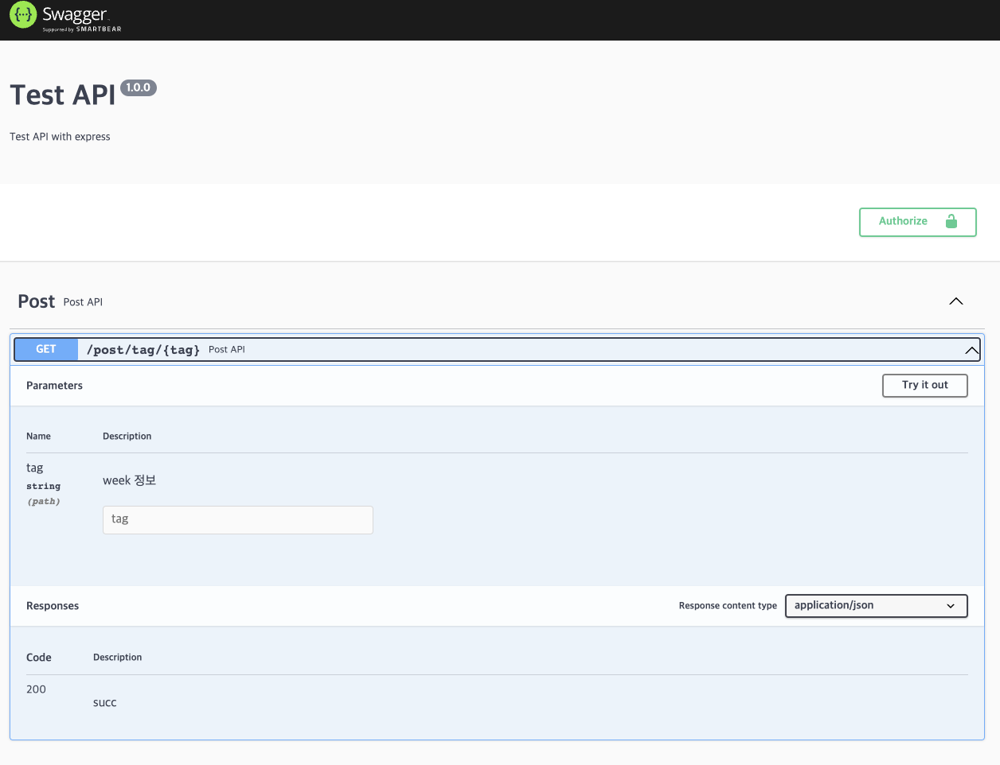

# swgger를 사용해보자

이전 프로젝트에서는 postman을 이용해 백엔드 api 문서를 생성했다. postman도 편하고 잘 동작하지만, swagger api를 사용해보려고 한다. yml파일을 생성해 하나의 파일에 정의하는 방식과 라우터 파일들에 직접 정의 할 수 있는 차이가 있다. swagger api 문서 자동화를 알아본다.

# swagger API 문서 자동 생성하기

swagger api 문서를 yaml 파일에 정의해서 사용할 수 있지만, 각 라우터 코드에 정의해서 사용할 수도 있다. routes 폴더 아래의 각 라우팅 파일에 주석으로 사용하는 방법이다.

## 패키지 설치

```bash
yarn add -D swagger-jsdoc swagger-ui-express
```

`swagger-jsdoc`과 `swagger-ui-express` 패키지를 개발 의존성으로 설치해 준다.

## swagger.js

```jsx
import swaggerUi from "swagger-ui-express"
import swaggereJsdoc from "swagger-jsdoc"

const options = {
  swaggerDefinition: {
    info: {
      title: "Test API",
      version: "1.0.0",
      description: "Test API with express",
    },
    servers: {
      description: "elice wiki",
      url: "http://localhost:5001",
    },
  },
  apis: ["./src/routes/*.js", "./src/db/models/*.js"],
}
const specs = swaggereJsdoc(options)
export { swaggerUi, specs }
```

`src`폴더 아래에 `swagger.js`를 생성해 위 코드를 작성해 준다. `swaggerDefinition`은 `swagger api` 문서의 버전과 설명을 정의하고, `apis`는 `swagger`의 주석이 존재하는 경로를 정의해 준다.

## app.js에 swagger 라우팅 경로 지정

```jsx
import { swaggerUi, specs } from "./swagger";
...
app.use("/swagger", swaggerUi.serve, swaggerUi.setup(specs));
```

`app.js`에 `swagger.js`파일을 import 하고, `/swagger` 경로로 swagger api 문서 자동화를 할 수 있게 정의해 준다.

## router에 swagger api 정의

```jsx
/**
 * @swagger
 * tags:
 *  name: Post
 *  description: Post API
 */
...
/**
 * @swagger
 * paths:
 *  /post/tag/{tag}:
 *   get:
 *    tags: [Post]
 *    summary: Post API
 *    parameters:
 *      - name: tag
 *        in: path
 *        type: string
 *        description: week 정보
 *    responses:
 *      200:
 *       description: succ
 *       content:
 *          application/json:
 *              schema:
//  *               $ref: '#/components/schemas/Post'
 *
 */
postRouter.get("/post/tag/:tag", postController.getPostsByTag);
```

/\*\* \*/주석에 `@swagger`를 넣어 swagger api임을 정의한다. yaml 문서 작성과 동일하게 작성해 주면 잘 동작한다.



백엔드 서버를 실행시킨 뒤 `/swagger`경로를 입력하면 위 그림처럼 잘 동작한다.

### 개선해야할 점

api 문서 부분은 잘 동작하는것을 확인했지만, schema를 정의하는 부분이 잘 동작하지 않아 어려움이 있다. 이후에 좀더 찾아보면서 해결할 것이다.
